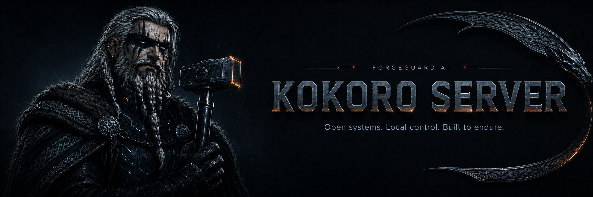
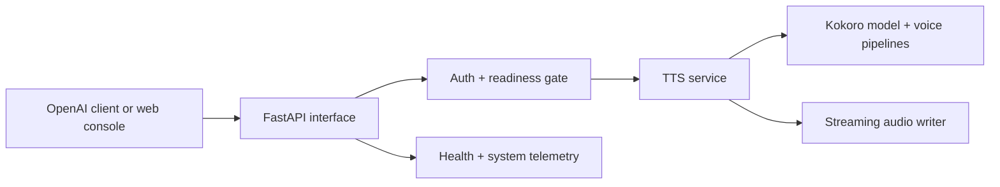

<div align="center">
  

<br>
<br>

<a href="./docs/site/index.md"></a>
<a href="https://github.com/forgeguard-ai/kokoro-server/releases"></a>
<a href="https://github.com/orgs/forgeguard-ai/packages?repo_name=kokoro-server"></a>
<a href="./SECURITY.md"></a>
<a href="./LICENSE"></a>

**A container-native, OpenAI-compatible text-to-speech server built on Kokoro-82M, for teams that want natural speech synthesis on infrastructure they control.**

[Quick start](#quick-start) ·
[Documentation](./docs/site/index.md) ·
[Releases](https://github.com/forgeguard-ai/kokoro-server/releases) ·
[Packages](https://github.com/orgs/forgeguard-ai/packages?repo_name=kokoro-server) ·
[Support](https://github.com/forgeguard-ai/kokoro-server/issues)

</div>

> **ForgeGuard original project.** Developed and maintained by
> [ForgeGuard AI](https://github.com/forgeguard-ai), with documented lineage from
> [remsky/Kokoro-FastAPI](https://github.com/remsky/Kokoro-FastAPI).

## Overview

ForgeGuard Kokoro Server wraps the [Kokoro-82M](https://huggingface.co/hexgrad/Kokoro-82M)
text-to-speech model behind an OpenAI-compatible HTTP API. Point any OpenAI speech client
at it, deploy it as a container or Helm release, and synthesize natural-sounding speech
without sending text to a third party.

It is built for operators. The server accepts connections immediately and warms the model
in the background, exposes distinct liveness and readiness contracts, ships model weights
baked into the images (offline by default), and offers optional bearer authentication and
built-in HTTPS. Distribution is **container images and a Helm chart only** — there is no
supported bare-metal install path.

## Key capabilities

| Capability | What it provides |
|---|---|
| OpenAI-compatible API | Drop-in `/v1/audio/speech`, `/v1/audio/voices`, and `/v1/models` for any OpenAI SDK. |
| Designed multi-language voices | English (US/GB), Spanish, French, Hindi, Italian, Japanese, Brazilian Portuguese, and Mandarin Chinese. |
| Voice mixing and controls | Weighted voice combinations, per-word timestamps, phoneme in/out, and inline pause/pronunciation tokens. |
| Streaming output | `mp3`, `wav`, `opus`, `flac`, and raw `pcm`, streamed or complete. |
| Orchestrator-friendly startup | Immediate liveness, background warmup, and a strict readiness contract. |
| Self-hosted control | Baked-in weights, offline by default, optional bearer auth, and built-in HTTPS. |

## Quick start

Run the CUDA (cu128) image, which covers NVIDIA RTX 3000 through RTX 5000 GPUs:

```bash
docker run -d --name kokoro --gpus all -p 8880:8880 \
  ghcr.io/forgeguard-ai/kokoro-server:latest
```

The server binds `0.0.0.0:8880` and warms the model in the background. Check liveness and
readiness:

```bash
curl http://localhost:8880/health   # 200 immediately: warming -> healthy
curl http://localhost:8880/ready    # 200 once the model can synthesize
```

Once `/ready` returns `200`, synthesize a clip:

```bash
curl -X POST http://localhost:8880/v1/audio/speech \
  -H 'Content-Type: application/json' \
  -d '{"model":"kokoro","input":"Hello world!","voice":"af_heart","response_format":"mp3"}' \
  -o hello.mp3
```

Or with the OpenAI SDK:

```python
from openai import OpenAI

client = OpenAI(base_url="http://localhost:8880/v1", api_key="not-needed")

with client.audio.speech.with_streaming_response.create(
    model="kokoro", voice="af_sky+af_bella", input="Hello world!",
) as response:
    response.stream_to_file("output.mp3")
```

No GPU? Drop `--gpus all` and add `-e USE_GPU=false`. Full walkthrough in the
[Quickstart](./docs/site/getting-started/quickstart.md).

## Deployment options

| Method | Intended use | Documentation |
|---|---|---|
| Container | Local testing and single-service deployment | [Container](./docs/site/deployment/container.md) |
| Docker Compose | Durable single-host operation | [Compose](./docs/site/deployment/compose.md) |
| Kubernetes (Helm) | Cluster and production deployment | [Kubernetes](./docs/site/deployment/kubernetes.md) |

Supported images: NVIDIA x86_64 (CUDA cu128) and NVIDIA Jetson Orin (arm64, JetPack 6).
See [Hardware profiles](./docs/site/deployment/hardware-profiles.md).

## Web console

A browser console is served at `/web` for trying voices, weighted blending, format and
speed controls, playback and download, warming status, and API-key entry when auth is
enabled.


## Architecture



The server is effectively stateless: audio is streamed back to the client, and anything
written to disk lives under `OUTPUT_DIR` (ephemeral unless you mount a volume). See the
[Architecture overview](./docs/site/architecture/overview.md).

## Documentation

- [Getting started](./docs/site/getting-started/quickstart.md)
- [Concepts](./docs/site/concepts/voices-and-languages.md)
- [Configuration](./docs/site/configuration/overview.md)
- [Deployment](./docs/site/deployment/container.md)
- [Operations](./docs/site/operations/health-and-readiness.md)
- [Architecture](./docs/site/architecture/overview.md)
- [Reference](./docs/site/reference/openai-api.md)
- [Troubleshooting](./docs/site/troubleshooting/common-errors.md)

Full index: [`docs/site/index.md`](./docs/site/index.md).

## Compatibility

| Target | Status | Notes |
|---|---|---|
| NVIDIA RTX 3000 → 5000 (x86_64, CUDA cu128) | Supported | Single cu128 image (sm_86–sm_120). |
| NVIDIA Jetson Orin (arm64) | Supported | JetPack 6 / L4T r36; use the Jetson image. |
| CPU (x86_64) | Supported | `USE_GPU=false`; reduced throughput. |
| AMD (ROCm), Intel | Planned | Not currently supported. |

Details in [Compatibility](./docs/site/reference/compatibility.md).

## Project status

Under active development and released under semantic versioning. Versioned image and chart
tags are recommended for persistent deployments; the `latest` tag tracks the newest stable
release and may change without notice. Published images are immutable at their version
tags. Planned work (real-time voice endpoints, more inference backends) is tracked as
roadmap, not current functionality.

## Support

- **Bugs and feature requests** — open a [GitHub issue](https://github.com/forgeguard-ai/kokoro-server/issues).
- **Security reports** — follow [SECURITY.md](./SECURITY.md); do not use public issues.
- See [SUPPORT.md](./SUPPORT.md) for scope and boundaries.

## Security

Do not report suspected vulnerabilities through a public issue. Follow the instructions in
[SECURITY.md](./SECURITY.md). Operator guidance (authentication, TLS, container posture) is
in [Security hardening](./docs/site/operations/security-hardening.md).

## Contributing

Contributions are welcome. Review [CONTRIBUTING.md](./CONTRIBUTING.md) before opening a
pull request. Development setup and maintainer procedures are documented under
[`docs/maintainers/`](./docs/maintainers/development/environment.md).

## License and attribution

Licensed under the [Apache License 2.0](./LICENSE); see [NOTICE](./NOTICE) for required
attributions. This is an original ForgeGuard project with documented lineage:

- Originally derived from [remsky/Kokoro-FastAPI](https://github.com/remsky/Kokoro-FastAPI) (Apache 2.0).
- [Kokoro-82M](https://huggingface.co/hexgrad/Kokoro-82M) model by [hexgrad](https://github.com/hexgrad) (Apache 2.0), with the [kokoro](https://github.com/hexgrad/kokoro) and [misaki](https://github.com/hexgrad/misaki) libraries.
- Inference code adapted from [StyleTTS2](https://github.com/yl4579/StyleTTS2) (MIT).

ForgeGuard-authored modifications are identified in the repository history and `NOTICE`.
