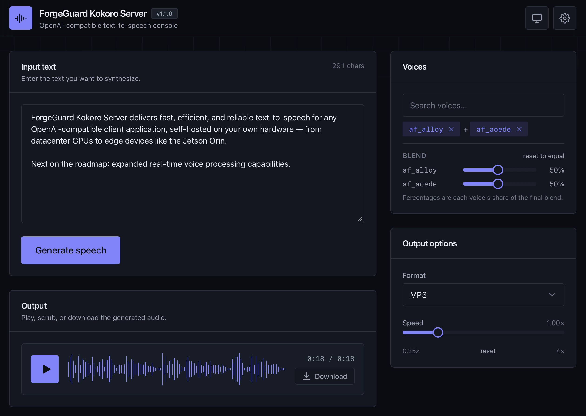

# ForgeGuard Kokoro Server

[](./LICENSE)
[](./CHANGELOG.md)
[](https://huggingface.co/hexgrad/Kokoro-82M)

**ForgeGuard Kokoro Server** is a container-native, OpenAI-compatible
text-to-speech server built around the
[Kokoro-82M](https://huggingface.co/hexgrad/Kokoro-82M) model. Forked from
[remsky/Kokoro-FastAPI](https://github.com/remsky/Kokoro-FastAPI)
(see [Attribution](#license--attribution)).

- **OpenAI-compatible** `/v1/audio/speech` endpoint — point any OpenAI SDK at it
- **Multi-language**: English (US/GB), Spanish, French, Hindi, Italian, Japanese,
  Brazilian Portuguese, Mandarin Chinese
- **Voice mixing** with weighted combinations, per-word timestamped captions,
  phoneme in/out endpoints, streaming (mp3/wav/opus/flac/pcm)
- **Instant health checks**: the server accepts connections immediately and warms
  the model in the background — orchestrator-friendly by design
- **Optional bearer auth** via a single `API_KEY` environment variable
- **Models baked into the images** — no downloads at container start
- Built-in **web console** at `/web` for testing and one-off use

Distribution is **container images + a Helm chart only**. There is no supported
bare-metal install path.

| Hardware | Image |
|---|---|
| NVIDIA RTX 3000 → 5000 series (x86_64, CUDA cu128) | `ghcr.io/forgeguard/kokoro-server:latest` (alias: `kokoro-server-cu128`) |
| NVIDIA Jetson Orin (arm64, JetPack 6) | `ghcr.io/forgeguard/kokoro-server-jetson:latest` |
| AMD (ROCm), Intel | planned — see [Roadmap](#roadmap) |

`:latest` works, but pin a release tag (e.g. `:1.1.0`) for stable deployments.

<div align="center">
  
</div>

## Quick start

```bash
# NVIDIA amd64 (RTX 3000 through RTX 5000)
docker run -d --name kokoro --gpus all -p 8880:8880 \
  ghcr.io/forgeguard/kokoro-server:latest

# NVIDIA Jetson (arm64, Orin)
docker run -d --name kokoro --runtime nvidia -p 8880:8880 \
  ghcr.io/forgeguard/kokoro-server-jetson:latest
```

Prefer Compose? [`docker/gpu/docker-compose.prod.yml`](docker/gpu/docker-compose.prod.yml)
is the offline-capable pull-and-run path (published image, baked weights, no source mounts).

Then:

```bash
curl http://localhost:8880/health          # 200 immediately: "warming" -> "healthy"
curl http://localhost:8880/ready           # 200 once the model can synthesize

curl -X POST http://localhost:8880/v1/audio/speech \
  -H 'Content-Type: application/json' \
  -d '{"model":"kokoro","input":"Hello world!","voice":"af_heart","response_format":"mp3"}' \
  -o hello.mp3
```

- Interactive API docs: `http://localhost:8880/docs`
- Web console: `http://localhost:8880/web`

Or with the OpenAI SDK:

```python
from openai import OpenAI

client = OpenAI(base_url="http://localhost:8880/v1", api_key="not-needed")

with client.audio.speech.with_streaming_response.create(
    model="kokoro",
    voice="af_sky+af_bella",   # single voice, or a weighted combination
    input="Hello world!",
) as response:
    response.stream_to_file("output.mp3")
```

### Authentication

Unset `API_KEY` (the default) leaves the API open. Set it, and every API route
requires `Authorization: Bearer <key>`:

```bash
docker run -d --gpus all -p 8880:8880 -e API_KEY=change-me \
  ghcr.io/forgeguard/kokoro-server:latest

curl -H 'Authorization: Bearer change-me' http://localhost:8880/v1/models
```

`/health`, `/ready`, `/system` (GPU/activity telemetry for the console monitor),
and the web console stay open (the console stores a key in its settings and
sends the bearer header for API calls).

## Health & readiness contract

The server binds `0.0.0.0:8880` and accepts connections immediately; the model
loads and warms in a background task (~seconds on datacenter GPUs, longer on
edge devices). This keeps orchestrator health polls happy during warmup.

| Endpoint | While warming | Ready | Failed warmup |
|---|---|---|---|
| `GET /health` (liveness) | `200 {"status":"warming","model_loaded":false}` | `200 {"status":"healthy","model_loaded":true}` | `503` (then the process exits non-zero) |
| `GET /ready` (readiness) | `503` + `Retry-After` | `200 {"status":"ready"}` | `503` |
| `POST /v1/audio/speech` | `503` + `Retry-After: 10`, error `model_warming` | normal | `503`, error `model_failed` |

A warmup that fails permanently (e.g. missing weights) exits the container with
a non-zero code so restart policies and orchestrators see the failure instead
of a healthy-looking server that can't synthesize.

Set `WARMUP_ON_START=false` to skip eager loading; the model then loads lazily
on the first request.

## Configuration

All settings are environment variables (see [`api/src/core/config.py`](api/src/core/config.py)
for the full list):

| Variable | Default | Purpose |
|---|---|---|
| `API_KEY` | *(unset)* | When set, require `Authorization: Bearer <key>` on API routes |
| `WARMUP_ON_START` | `true` | Eagerly load + warm the model at startup (background task) |
| `USE_GPU` | `true` | `false` forces CPU inference (works in the cu128 image on non-GPU hosts) |
| `DEFAULT_VOICE` | `af_heart` | Voice used for warmup and when requests omit one |
| `API_LOG_LEVEL` | `INFO` | Application (loguru) log level |
| `UVICORN_LOG_LEVEL` | `info` | Uvicorn server log level |
| `ENABLE_WEB_PLAYER` | `true` | Serve the web console at `/web` |
| `TLS_ENABLED` | `false` | Serve HTTPS directly (uvicorn SSL) — see [Built-in HTTPS](#built-in-https) |
| `TLS_SELF_SIGNED` | `true` | Auto-generate a self-signed cert on first run if none is provided |
| `TLS_CN` / `TLS_SAN` | `localhost` / *(unset)* | Cert common name and extra SANs (`TLS_SAN` is comma-separated) |
| `TLS_CERT_FILE` / `TLS_KEY_FILE` | `{OUTPUT_DIR}/tls/…` | Point at an existing cert/key instead of self-signing |
| `OUTPUT_DIR` | `output` | Where generated audio and the self-signed TLS cert are persisted |
| `CORS_ENABLED` / `CORS_ORIGINS` | `true` / `["*"]` | CORS for browser clients |
| `TARGET_MIN_TOKENS` / `TARGET_MAX_TOKENS` / `ABSOLUTE_MAX_TOKENS` | `175` / `250` / `450` | Long-form chunking bounds |
| `DOWNLOAD_MODEL` | *(unset)* | `true` re-downloads weights at container start (they're already baked in) |
| `MODEL_DOWNLOAD_BASE_URL` | Hugging Face `hexgrad/Kokoro-82M` | Where build/startup fetches weights |
| `MODEL_SHA256` | pinned for the default URL | Weights checksum verification |

## Built-in HTTPS

Set `TLS_ENABLED=true` and the server speaks HTTPS directly — no reverse proxy,
no manual `openssl`, no extra container. If no certificate is supplied and
`TLS_SELF_SIGNED=true` (default), a self-signed cert (RSA 2048, ~10-year
validity, SANs for `TLS_CN` + `localhost` + loopback + any `TLS_SAN`) is
generated on first start and persisted under `{OUTPUT_DIR}/tls`, so restarts
reuse it. Browsers warn on self-signed certs — expected for local/self-hosted
testing; point `TLS_CERT_FILE` / `TLS_KEY_FILE` at a CA-issued cert for public
use.

The ready-to-run local single-GPU stack (TLS on, GPU reserved, HTTPS on 8443,
persistent volume) is:

```bash
docker compose -f docker/gpu/docker-compose.local.yml up -d --build
# then open https://localhost:8443/web/
```

See [`docs/security.md`](docs/security.md) for the full posture and
[`docs/responsible-use.md`](docs/responsible-use.md) for synthetic-media
guidance.

## API overview

Everything under `/v1` is OpenAI-style; supporting routes live under `/dev` and
`/debug`. Full interactive reference at `/docs`.

<details>
<summary>Voices & weighted combinations</summary>

```python
import requests

voices = requests.get("http://localhost:8880/v1/audio/voices").json()["voices"]

# Equal 50/50 mix
requests.post("http://localhost:8880/v1/audio/speech", json={
    "input": "Hello world!", "voice": "af_bella+af_sky", "response_format": "mp3",
})

# Weighted 2:1 mix (67%/33%) — weights normalize automatically
requests.post("http://localhost:8880/v1/audio/speech", json={
    "input": "Hello world!", "voice": "af_bella(2)+af_sky(1)", "response_format": "mp3",
})

# Persist a combination as a reusable voicepack
requests.post("http://localhost:8880/v1/audio/voices/combine", json="af_bella(2)+af_sky(1)")
```
</details>

<details>
<summary>Streaming</summary>

```python
from openai import OpenAI

client = OpenAI(base_url="http://localhost:8880/v1", api_key="not-needed")

# Stream raw PCM to speakers (requires PyAudio)
import pyaudio
player = pyaudio.PyAudio().open(format=pyaudio.paInt16, channels=1, rate=24000, output=True)

with client.audio.speech.with_streaming_response.create(
    model="kokoro", voice="af_bella", response_format="pcm", input="Hello world!"
) as response:
    for chunk in response.iter_bytes(chunk_size=1024):
        player.write(chunk)
```

Formats: `mp3`, `wav`, `opus`, `flac`, `pcm` (raw 16-bit, 24 kHz mono).
</details>

<details>
<summary>Timestamped captions</summary>

`POST /dev/captioned_speech` takes the same body as `/v1/audio/speech` and
returns base64 audio plus word-level timestamps:

```python
import base64, requests

r = requests.post("http://localhost:8880/dev/captioned_speech", json={
    "model": "kokoro", "input": "Hello world!", "voice": "af_bella",
    "response_format": "mp3", "stream": False,
})
payload = r.json()
open("output.mp3", "wb").write(base64.b64decode(payload["audio"]))
print(payload["timestamps"])   # [{"word": "Hello", "start_time": ..., "end_time": ...}, ...]
```

With `"stream": true` the response is JSON lines, one chunk per line.
</details>

<details>
<summary>Phonemes in and out</summary>

```python
import requests

# Text -> phonemes/tokens ("a" = American English)
r = requests.post("http://localhost:8880/dev/phonemize",
                  json={"text": "Hello world!", "language": "a"})
phonemes = r.json()["phonemes"]

# Phonemes -> audio
audio = requests.post("http://localhost:8880/dev/generate_from_phonemes",
                      json={"phonemes": phonemes, "voice": "af_bella"}).content
open("speech.wav", "wb").write(audio)
```
</details>

<details>
<summary>Inline control tokens</summary>

Two tokens can be embedded in the `input` text and are parsed server-side:

- **Pause**: `[pause:1.5s]` inserts that much silence. Must be exactly this form
  (colon, trailing `s`, case-insensitive). SSML `<break/>` is not recognized.
- **Pronunciation**: `[Worcester](/wˈʊstər/)` speaks the IPA between the slashes
  instead of the word. English only; use `/dev/phonemize` to find the IPA.

```text
The city of [Worcester](/wˈʊstər/) is easy. [pause:1s] See?
```
</details>

<details>
<summary>Long-form input handling</summary>

Input is automatically split and stitched at sentence boundaries — the base
model is tuned for roughly 30-second outputs, so the server re-chunks long text
using `TARGET_MIN_TOKENS` / `TARGET_MAX_TOKENS` / `ABSOLUTE_MAX_TOKENS`
(defaults 175/250/450).
</details>

<details>
<summary>Operational endpoints</summary>

- `GET /debug/threads` — thread info and stack traces
- `GET /debug/storage` — temp/output directory usage
- `GET /debug/system` — CPU, memory, GPU info
- `POST /dev/unload` — release the model from VRAM; it reloads lazily on the next request
</details>

## Web console

A React console (pictured above) is served at `/web` for trying voices and
one-off generation: voice search with weighted blending, format/speed
controls, playback and download, warming status, and API-key entry when auth
is enabled. Disable it with `ENABLE_WEB_PLAYER=false`.

## Kubernetes (Helm)

```bash
helm install kokoro oci://ghcr.io/forgeguard/charts/kokoro-server --version 1.1.0
```

The chart (also in [`charts/kokoro-server`](charts/kokoro-server)) wires the
health contract into probes: `startupProbe` and `readinessProbe` on `/ready`,
`livenessProbe` on `/health`, so pods receive traffic only after warmup without
being restarted during it. GPU scheduling uses `nvidia.com/gpu` limits (default
1). API keys come from a Kubernetes Secret via `kokoroTTS.apiKey.existingSecret`.
See [`values.yaml`](charts/kokoro-server/values.yaml) for ingress, autoscaling,
and probe tuning.

## Building

```bash
# amd64 CUDA (cu128)
docker build -f docker/gpu/Dockerfile.optimized -t kokoro-server:dev .

# Jetson (arm64, on-device or on an arm64 builder)
docker build -f docker/jetson/Dockerfile -t kokoro-server-jetson:dev .
```

Both images bake the model weights at build time (`DOWNLOAD_MODEL=true` build
arg, fetching from Hugging Face with checksum verification) and build the web
console in a Node stage — no network needed at container start. Release images
are published by [`.github/workflows/release.yml`](.github/workflows/release.yml)
on version tags.

## Testing

```bash
# Unit tests (CPU torch)
uv run --extra test --extra cpu pytest api/tests/

# End-to-end integration (builds the server + a Whisper-equipped test client,
# round-trips audio through faster-whisper and checks WER)
docker compose -f docker/docker-compose.test.yml up --build \
  --abort-on-container-exit --exit-code-from test-client
```

## Troubleshooting

<details>
<summary>Missing words or timestamps</summary>

Text normalization can occasionally drop or rewrite phrases. Disable it per
request with `"normalization_options": {"normalize": false}`.
</details>

<details>
<summary>Linux GPU permissions</summary>

If the container can't access the GPU as non-root, add the container to the
`video`/`render` groups (compose: `group_add: ["video", "render"]`), and make
sure the [NVIDIA Container Toolkit](https://docs.nvidia.com/datacenter/cloud-native/container-toolkit/latest/install-guide.html)
is installed and configured.
</details>

<details>
<summary>WAV duration reported as nonsense in some readers</summary>

WAV responses ship with streaming-sentinel (`0xFFFFFFFF`) size fields in the
header. Most readers (soundfile, pydub/ffmpeg, browsers, OS players) handle
this fine; Python's stdlib `wave` does not. Use `soundfile.info(path).duration`
or `ffprobe` for exact length.
</details>

## Roadmap

- **Real-time voice endpoints** — first-class low-latency streaming synthesis
  for conversational and agent workloads: incremental synthesis over a
  persistent connection (WebSocket/SSE), time-to-first-audio tuned chunking,
  and barge-in-friendly cancellation, alongside the existing OpenAI-style
  request/response and chunked-streaming endpoints.
- **More inference backends** — AMD (ROCm) and Intel images, plus newer
  inference libraries/frameworks as hardware becomes available to develop
  and validate on.

## License & attribution

This repository is licensed under the [Apache License 2.0](LICENSE); see
[NOTICE](NOTICE) for required attributions.

- Forked from [remsky/Kokoro-FastAPI](https://github.com/remsky/Kokoro-FastAPI)
  (Apache 2.0) — the original Dockerized FastAPI wrapper this project builds on.
- [Kokoro-82M](https://huggingface.co/hexgrad/Kokoro-82M) model weights by
  [hexgrad](https://github.com/hexgrad) (Apache 2.0), with
  [kokoro](https://github.com/hexgrad/kokoro) and
  [misaki](https://github.com/hexgrad/misaki) libraries.
- Inference code adapted from [StyleTTS2](https://github.com/yl4579/StyleTTS2) (MIT).
