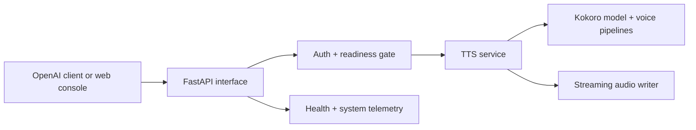

# Architecture overview

ForgeGuard Kokoro Server is a FastAPI application that wraps the Kokoro-82M model behind
an OpenAI-compatible HTTP interface, with an authentication and readiness gate in front
of synthesis and a streaming audio encoder behind it.

## Components

- **FastAPI interface** — routes: OpenAI-compatible endpoints under `/v1`, extended
  endpoints under `/dev` and `/debug`, the web console under `/web`, and the
  unauthenticated `/health`, `/ready`, and `/system`.
- **Auth + readiness gate** — a dependency that enforces the optional `API_KEY` and
  short-circuits synthesis routes with `503` while the model is warming or after a failed
  warmup. See [Health and readiness](../operations/health-and-readiness.md).
- **TTS service** — resolves the voice (including weighted combinations), chunks long
  input at sentence boundaries, and drives inference.
- **Kokoro model + voice pipelines** — the Kokoro-82M backend and per-language
  grapheme-to-phoneme pipelines that produce audio frames.
- **Streaming audio writer** — encodes frames into `mp3`, `wav`, `opus`, `flac`, or raw
  `pcm`, either streamed or as a complete response.
- **Health + system telemetry** — liveness/readiness plus GPU and activity telemetry for
  operators and the console.

## Trust boundary

The trust boundary is the HTTP interface. When `API_KEY` is set, `/v1`, `/dev`, and
`/debug` require a bearer token; `/health`, `/ready`, `/system`, and `/web` are always
open by design. The server makes no external network calls at runtime — the model and
voices are baked in and offline flags are set. See
[Security hardening](../operations/security-hardening.md).

## Persistence boundary

The server is effectively stateless. Synthesized audio is streamed back to the client;
anything written to disk lives under `OUTPUT_DIR` (generated files and, with built-in
TLS, the self-signed certificate) plus a short-lived temp directory that is
garbage-collected. Unless you mount a volume at `OUTPUT_DIR`, that storage is ephemeral.

## See also

- [Request lifecycle](./request-lifecycle.md)
- [Voices and languages](../concepts/voices-and-languages.md)
- [Streaming and audio formats](../concepts/streaming-and-audio-formats.md)
