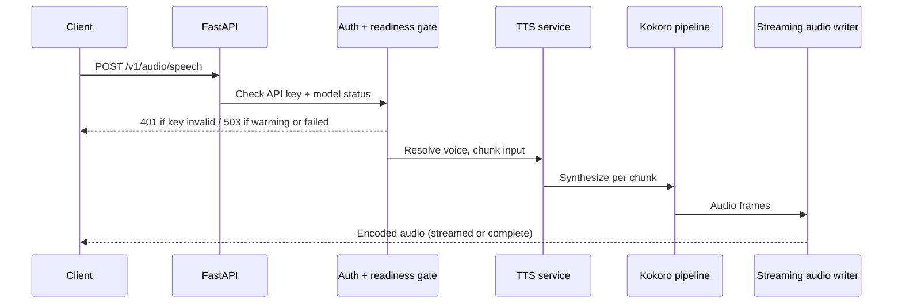

# Request lifecycle

This page traces a `POST /v1/audio/speech` request and the startup warmup that must
complete before synthesis succeeds.

## Startup and warmup

1. The process launches via `python -m api.src.serve`, which wires a TLS certificate when
   `TLS_ENABLED` is set, then starts uvicorn bound to `0.0.0.0:8880`.
2. The socket opens and `/health` immediately answers `200` with `status: warming`.
3. A background task loads the Kokoro model and voice packs and runs a short warmup
   synthesis.
4. On success the status flips to `ready` (and `/ready` returns `200`); a startup panel
   is logged. On permanent failure the status is set to `failed` and the process exits
   non-zero so an orchestrator can restart it.

With `WARMUP_ON_START=false`, steps 3–4 are deferred to the first synthesis request.

## A synthesis request

Step by step:

1. **Authentication** — when `API_KEY` is set, the bearer token is verified
   (constant-time); a bad or missing key returns `401`.
2. **Readiness gate** — if the model is warming, the request returns `503` with
   `Retry-After: 10` and error `model_warming`; if warmup failed, `503` with
   `model_failed`.
3. **Validation** — the model name is checked, and the `voice` string is parsed and
   validated (including weighted combinations); invalid input returns `400`.
4. **Voice resolution** — a single voice tensor or a normalized weighted combination is
   assembled and cached.
5. **Chunking** — long input is split at sentence boundaries using the configured token
   bounds.
6. **Synthesis** — each chunk is synthesized by the Kokoro pipeline for the resolved
   language.
7. **Encoding** — frames are encoded by the streaming audio writer into the requested
   format and either streamed (chunked transfer, default) or returned as one complete
   response.

## Related behavior

- Captioned synthesis (`/dev/captioned_speech`) follows the same path but returns
  base64 audio plus word-level timestamps. See
  [Extended API](../reference/extended-api.md).
- `POST /dev/unload` frees the model from VRAM between requests; the next request reloads
  it lazily.

## See also

- [Architecture overview](./overview.md)
- [Health and readiness](../operations/health-and-readiness.md)
